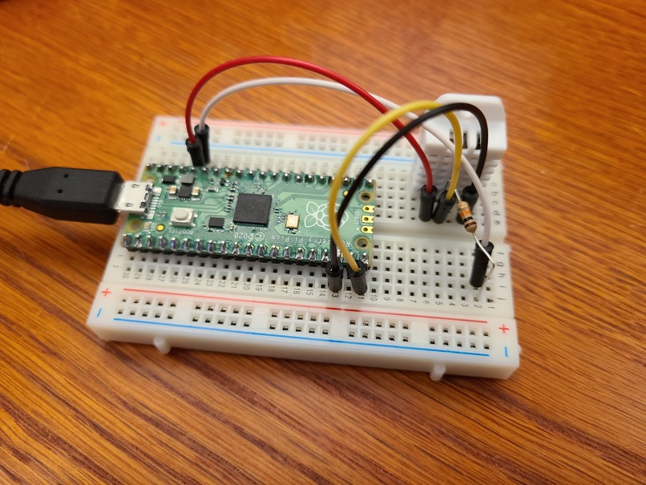
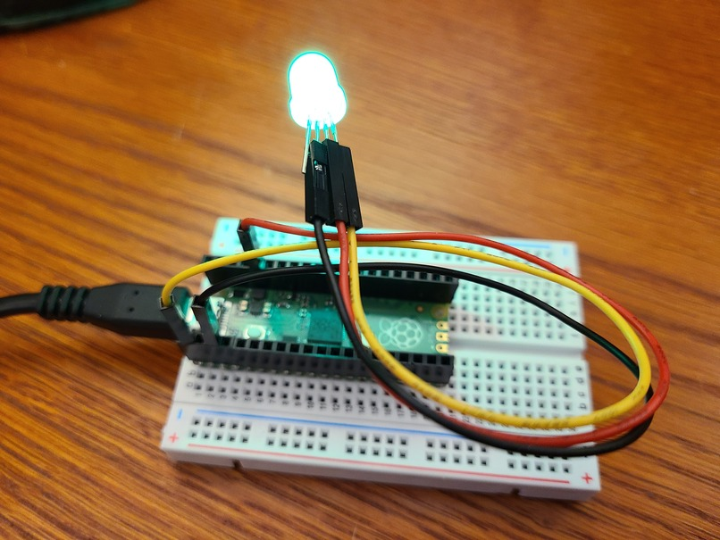

# Compiling Raspberry Pi Pico C/C++ programs on Fedora

This repository contains hints and tips on how to configure your
Fedora workstation to cross compile Raspberry Pi Pico C/C++ programs.

## Raspberry Pi Pico Introduction

The [Raspberry Pi Pico board](https://www.raspberrypi.org/documentation/pico/getting-started/)
and RP2040 microcontroller are an interesting MCU for hardware and software engineers.
I recently purchased several Pico boards and soldered headers onto the PCB.

Since I run [Fedora Linux](fedoraproject.org/) on my laptop, I wanted to cross
compile the RP2040 example programs using the
[Raspberry Pi Pico C/C++ SDK](https://datasheets.raspberrypi.org/pico/getting-started-with-pico.pdf).
The SDK guide provides instructions on how to install the SDK and examples on a Raspberry Pi.
While I have lots of Raspberry Pi devices, I don't use them as a development
platform for obvious performance reasons. The installation scripts assume a
Raspberry Pi OS running on a Raspberry Pi 4 or an equivalent Debian-based Linux distribution.
The goal of this tutorial is to document how to use the Pico C SDK on a Fedora development system.

## Install Fedora dependencies

My Fedora 33 system has most of the `dnf grouplist "C Development Tools and Libraries"` packages
already installed, so this guide doesn't cover how to install binutils, gcc, gcc-c++, cmake, make, doxygen, git toolchains.
If you're new to C/C++ development on Fedora, there are better guides for those steps.
This section of the tutorial details how to install the ARM cross compiler packages.

### Install the ARM cross compiler dependencies

There's a great [Fedora Embedded wiki](https://fedoraproject.org/wiki/Embedded) that provided
helpful hints.

Here's a minimal list of dependencies that will pull in additional required packages.
You will need approximately 1GB of disk space.

```
sudo dnf install gcc-arm-linux-gnu \
 arm-none-eabi-gcc-cs-c++ \
 arm-none-eabi-gcc-cs \
 arm-none-eabi-binutils \
 arm-none-eabi-newlib
```

### Clone the pico-sdk and pico-examples repositories

The `pico-examples` repository ([https://github.com/raspberrypi/pico-examples](https://github.com/raspberrypi/pico-examples))
provides a set of example applications that are written using the
`pico-sdk` ([https://github.com/raspberrypi/pico-sdk](https://github.com/raspberrypi/pico-sdk)).
Run the following commands to clone the pico-sdk and pico-examples repositories
to an appropriate development subdirectory on your system.

```
git clone git@github.com:raspberrypi/pico-sdk.git
git clone git@github.com:raspberrypi/pico-examples.git
```
There is a `tinyusb` git submodule directory that you should clone too.
```
cd ./pico-sdk/src/rp2_common/tinyusb
git submodule update --init
cd -
```

### Compile the Pico Examples

The next step will take a few minutes.

```
cd pico-examples
cmake -DPICO_SDK_PATH=../pico-sdk .
make
```

The compiler generates a **.uf2** binary for each sample program.

### Flashing the RP2040 Binary

The simplest method to load software onto a RP2040-based board is by mounting it as a USB Mass Storage Device. Connect your Fedora laptop to your Raspberry Pi Pico using a Micro-USB cable, making sure that you hold down the BOOTSEL button to force it into USB Mass Storage mode. You can drag the **.uf2** file onto the board to program the flash. The RP2040 will reboot, unmounting itself as a Mass Storage Device, and start to run the flashed code.


There's a nice little [animated gif](https://www.raspberrypi.org/documentation/pico/getting-started/static/92dabbc476b6b5ac7600c85a2df88200/Blink-an-LED-FINAL.gif).

## Run the Pico Examples

The `pico-examples` repository contains a variety of sample programs.  The Raspberry Pi Foundation team and community have created some great examples that showcase the capabilities of the RP2040. I flashed and wired up a few of them on a breadboard.

### Hello World (USB) Example

Start off with the [Hello World program](https://github.com/raspberrypi/pico-examples/tree/master/hello_world) for Pico.

- Hold down the BOOTSEL button to force it into USB Mass Storage mode.
- Drag or copy the `pico-examples/hello_world/usb/hello_usb.uf2` to the **RPI-RP2** mounted volume.
- Open a serial terminal on `/dev/ttyACM0`

  ```
  $ miniterm.py /dev/ttyACM0 115200
  --- Miniterm on /dev/ttyACM0  115200,8,N,1 ---
  --- Quit: Ctrl+] | Menu: Ctrl+T | Help: Ctrl+T followed by Ctrl+H ---
  Hello, world!
  Hello, world!
  Hello, world!
  Hello, world!
  Hello, world!

  --- exit ---
  ```

### Blink Example

Blink the onboard LED by flashing the [Blink program](https://github.com/raspberrypi/pico-examples/tree/master/blink) for Pico.  For more tips you can read the Raspberry Pi Blog
["How to blink an LED with Raspberry Pi Pico in C"](https://www.raspberrypi.org/blog/how-to-blink-an-led-with-raspberry-pi-pico-in-c/)

- Hold down the BOOTSEL button to force it into USB Mass Storage mode.
- Drag or copy the `pico-examples/blink/blink.uf2` to the **RPI-RP2** mounted volume.

### DHT Temperature Sensor Example

The [DHT Temperature / Humidity sensor program](https://github.com/raspberrypi/pico-examples/blob/master/gpio/dht_sensor) reads a DHT-11 / DHT-22 via GPIO pin 15.

- Hold down the BOOTSEL button to force it into USB Mass Storage mode.
- Drag or copy the `pico-examples/gpio/dht_sensor/dht.uf2` to the **RPI-RP2** mounted volume.
- Wire a DHT sensor on a breadboard.  (The [Raspberry Pi Pico C SDK Guide](https://datasheets.raspberrypi.org/pico/raspberry-pi-pico-c-sdk.pdf) pg73 has a nice wiring diagram.)
  
- Open a serial terminal on `dev/ttyACM0`

  ```
  $ miniterm.py /dev/ttyACM0 115200
  --- Miniterm on /dev/ttyACM0  115200,8,N,1 ---
  --- Quit: Ctrl+] | Menu: Ctrl+T | Help: Ctrl+T followed by Ctrl+H ---
  Humidity = 22.8%, Temperature = 18.6C (65.5F)
  Humidity = 22.9%, Temperature = 18.6C (65.5F)
  Humidity = 22.7%, Temperature = 18.6C (65.5F)
  Humidity = 22.5%, Temperature = 18.6C (65.5F)
  Humidity = 22.6%, Temperature = 18.6C (65.5F)

  --- exit ---
  ```

### Neopixel WS2812B RGB LEDs Example

Every IoT hobbyist has a Neopixel and loves a fully addressable blinky light.  Use the [ws2812 program](https://github.com/raspberrypi/pico-examples/tree/master/pio/ws2812) to blink an external RGB LED.

- Hold down the BOOTSEL button to force it into USB Mass Storage mode.
- Drag or copy the `pico-examples/pio/ws2812/pio_ws2812.uf2` to the **RPI-RP2** mounted volume.
- Wire a Neopixel to your Raspberry Pi Pico.

  

### Bonus - picotool

If you want to use the picotool to inspect / load programs onto the RP2040,
Appendix B of the [SDK guide](https://datasheets.raspberrypi.org/pico/getting-started-with-pico.pdf)
details the installation instructions.  You will need to install these Fedora packages:

```sudo dnf install libusb1-devel libusb1```

### Board Specifications


### Author

- [John Walicki](https://github.com/johnwalicki)
___

Enjoy!  Give me [feedback](https://github.com/johnwalicki/RaspPi-Pico-Examples-Fedora/issues) if you have suggestions on how to improve this tutorial.

## License

This tutorial is licensed under the BSD License.
